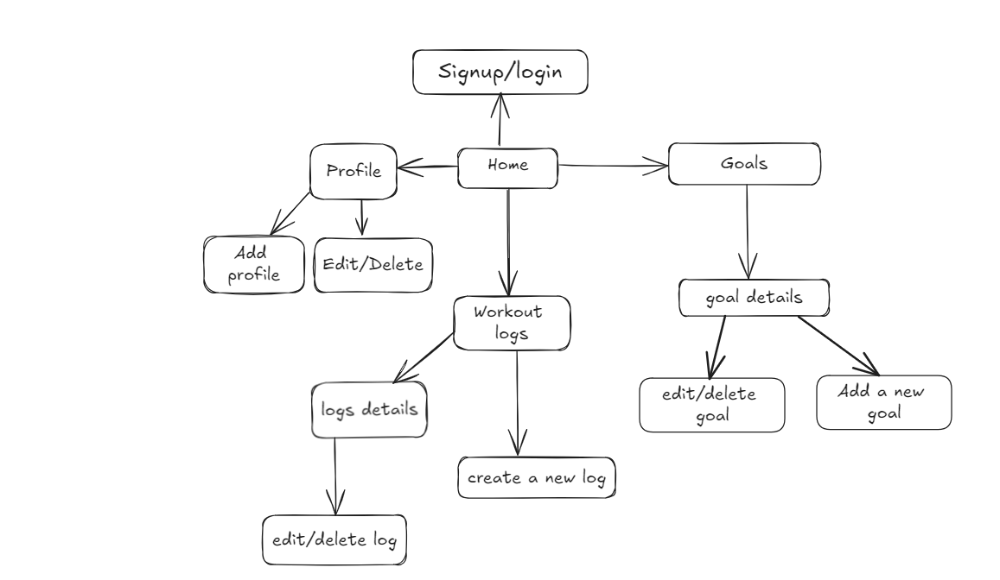
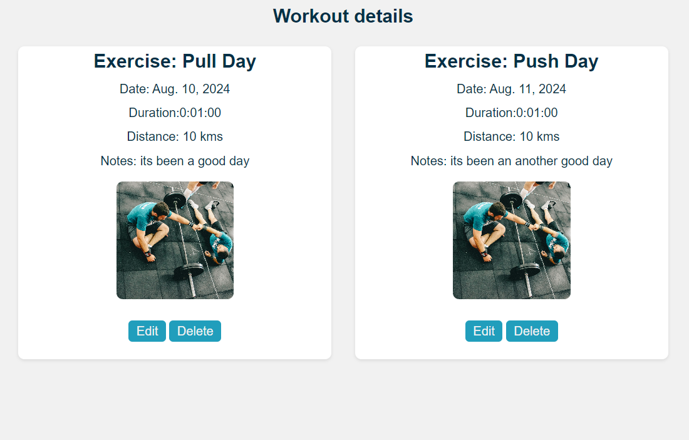
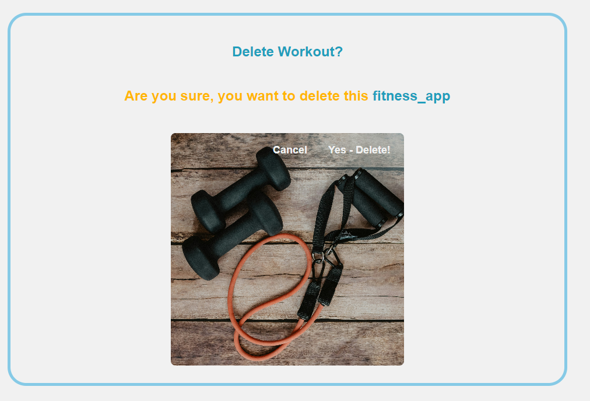

# django-fitness-app

## Project Description: 
The django based fitness app is designed to help users to track their workout and goals progress on daily basis. Users will have the ability to create, read, update and delete their profile, workouts and goals. Users can also compare their progress by keeping the track of thier workout logs and achieved or to be achhieved goals.

## MVP
- User Authentication
- Profile management
- Workout Tracking
- Goal Setting

## User Stories:
1. Allow the new users to sign-up for a account to track the fitness activities.
2. Allow users to login and out of the account so that user can access their data securely.
3. Allow new users to add new workouts and details so that they can track their progress.
4. Allow users to view the list of their past workouts and provide them ability to edit or delete their workout.s
5. Allow users to set the fitness goals and see the progress towards their goal.
6. Allow users to edit and delete their fitness goals.

## Technologies Used:
- Python
- Django
- Psql
- Javascript
- Html
- Css

## Wireframe:


## Getting Started:
1. `Fork` and `clone` the repository in your local machine
     - open your terminal and run git `clone` https://github.com/your-username/django-fitness-app.git
2. Navigate to project by using command `cd` django-fitness-app
3. Install required dependencies such as `pipenv install django` and `pipenv shell`
4. Run the project by using command `python manage.py runserver`

## Screenshots from app:




## Code snippets:

```python
 class Profile(models.Model):
    user = models.OneToOneField(User, on_delete=models.CASCADE)
    name = models.CharField(max_length=100)
    age = models.IntegerField(null=True, blank=True)
    weight = models.CharField(max_length=10, null=True, blank=True)
    height = models.CharField(max_length=10, null=True, blank=True)
    gender = models.CharField(max_length=10, null=True, blank=True)

class Workout(models.Model):
    user = models.ForeignKey(User, on_delete= models.CASCADE)
    date = models.DateField()
    exercise = models.CharField(max_length=255)
    duration = models.DurationField()
    distance = models.CharField(max_length=10, null = True, blank= True)
    notes = models.TextField(blank=True)


class Goal(models.Model):
    user = models.ForeignKey(User, on_delete=models.CASCADE)
    target_weight = models.CharField(max_length=10, null = True, blank= True)
    target_date = models.DateField()
    purpose_to_train = models.CharField(max_length=100, null = True, blank= True)
```

## ERD:

## User
id, name, email, password

## Profile 
id, name, age, weight, height, gender, `OneToOneField` to User

## logs
id, date, total_sets, reps_forEach_Set, total_duration, total_distance, `ForeignKey` to User

## goals
id, target_weight, target_height, target_date, `ForeignKey` to User

## Future Update:
 Few things could be done with that app such as adding an API call to fetch the workouts from youtube or fetching data for nutrients of different foods
 
